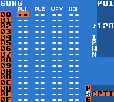

# Урок 1

Допустим к вам в руки попал __Gameboy__ с картриджем __LSDJ__.

## Экран Song
---
С ходы мы попадаем на экран _Песни_

 

> Слева сверху можно наблюдать заголовок (**Song**) который собственно и говорит нам, на каком экране мы находимся.

На этом экране можно наблюдать 4 колонки.
Каждая из них соответвует 4 каналам, доступным в **Gameboy**.

* **PU1** - прямоугольная волна и *Sweep* эффект (о нем позже)
* **PU2** - прямоугольная волна
* **WAV** - программируемый _табличным_ синтезатор (**wavetable**) (тоже позже)
* **NOI** - шумогенератор!

В первом уроке остановимся на основах, разберемся с навигацией по программе и напишем небольшой луп (небольшое зацикленное музыкальное нечто).
